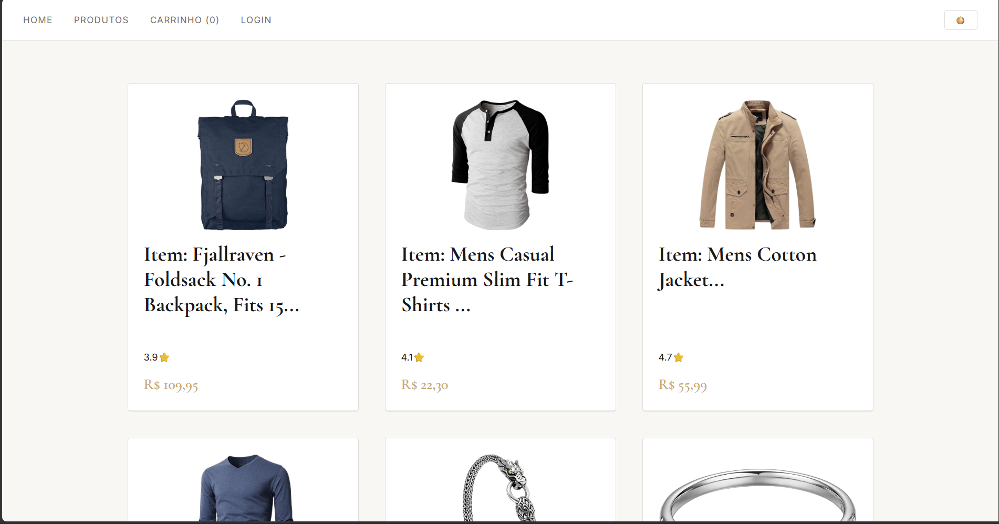
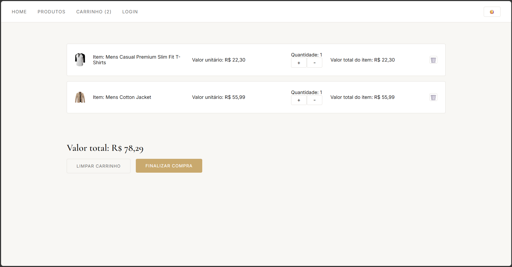

# 🛍️ Fake Store — E-commerce React

Aplicação de e-commerce completa desenvolvida com React, consumindo a [Fake Store API](https://fakestoreapi.com). Projeto criado como parte de um plano de estudos estruturado para desenvolvimento Full Stack, com foco em boas práticas de arquitetura e experiência do usuário.

Link deploy: https://fake-store-api-app-two.vercel.app/

---

## ✨ Funcionalidades

- 🔐 **Autenticação** — Login e logout com JWT, sessão persistida no localStorage
- 🛒 **Carrinho** — Adicionar, remover e alterar quantidade de itens, com persistência entre sessões
- 🏪 **Catálogo** — Listagem de produtos com avaliação e preço formatado
- 🔍 **Detalhe do produto** — Página individual com descrição e opção de adicionar ao carrinho
- 📦 **Checkout** — Resumo do pedido e formulário de entrega
- 🌗 **Tema claro/escuro** — Alternância de tema persistida globalmente
- 🔒 **Rota protegida** — Checkout acessível apenas para usuários autenticados

---

## 🚀 Tecnologias

- **React 18** — Biblioteca principal
- **React Router v6** — Navegação e rotas protegidas
- **Context API** — Gerenciamento de estado global (Auth, Carrinho, Tema)
- **useReducer** — Lógica do carrinho com múltiplas actions
- **Fake Store API** — API REST pública para produtos e autenticação
- **Vite** — Bundler e ambiente de desenvolvimento
- **CSS puro** com variáveis CSS para theming

---

## 🗂️ Arquitetura

```
src/
├── components/
│   └── layout/       # Navbar
├── contexts/         # AuthContext, CarrinhoContext, ThemeContext
├── hooks/            # useProdutos
├── pages/            # Home, Produtos, Detalhes, Carrinho, Checkout, Login
├── services/         # api.js — camada de fetch centralizada
└── utils/            # formatarMoeda
```

**Padrão de camadas:**
```
Componente → Hook → Service → API
```

Cada camada tem responsabilidade única — o service cuida do fetch, o hook gerencia estado e efeitos, o componente cuida da renderização.

---

## ⚙️ Como rodar localmente

```bash
# Clone o repositório
git clone https://github.com/mfreitas-dev/fake_store_api_app

# Instale as dependências
npm install

# Inicie o servidor de desenvolvimento
npm run dev
```

Acesse `http://localhost:5173`

**Credenciais de teste:**
```
Usuário: mor_2314
Senha: 83r5^_
```

---

## 📸 Screenshots

| Home | Produtos | Carrinho |
|------|----------|----------|
|| ||

---

## 🧠 Conceitos praticados

- Arquitetura em camadas (services, hooks, components, pages)
- Autenticação com JWT e persistência de sessão
- Gerenciamento de estado complexo com `useReducer` + Context
- Rotas protegidas com React Router v6
- AbortController para cancelamento de requisições
- Inicialização lazy do estado com localStorage
- Theming com variáveis CSS e Context API
- Responsividade com CSS Grid e media queries

---

## 🔗 Links

- 🌐 **Deploy:** [https://fake-store-api-app-two.vercel.app/]
- 👨‍💻 **Portfólio:** [https://mfreitas-dev.github.io/]
- 💼 **LinkedIn:** [https://linkedin.com/in/matheus-bomfim-santos-freitas]

---

Desenvolvido por **Matheus Bomfim** como parte de uma trilha de estudos estruturada em React para Full Stack.